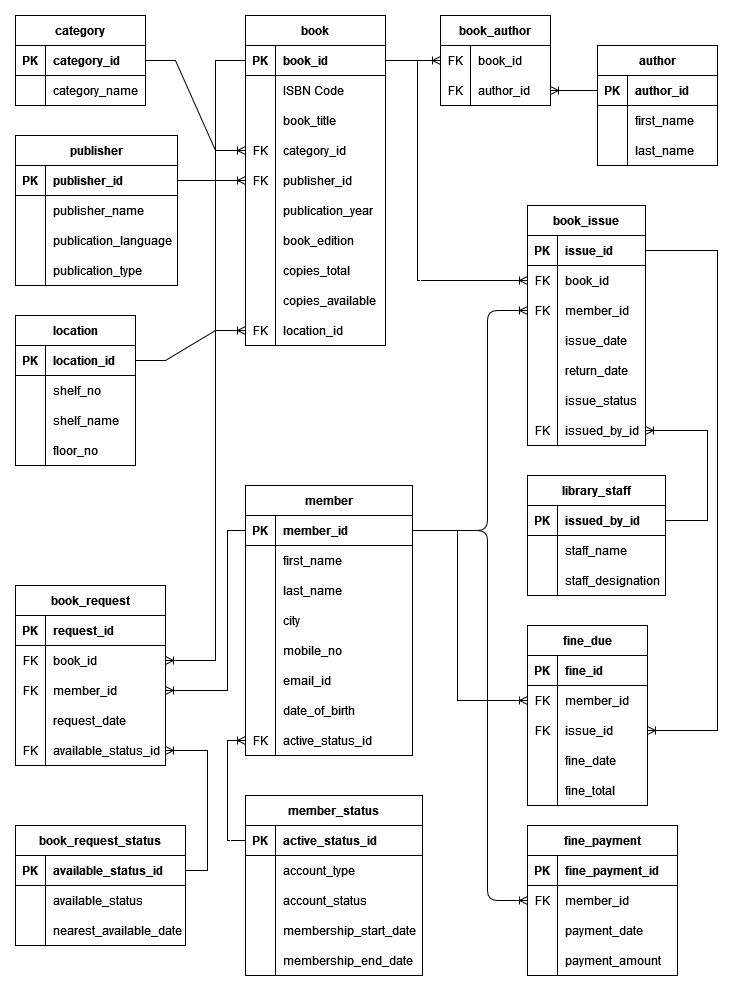

# Library Management System Database Design

This document outlines the structure and SQL queries used for creating a Library Management System database. The database contains tables for categories, publishers, locations, books, authors, members, staff, issues, fines, requests, and payments.
## Entity-Relationship Diagram


## Tables and Queries

## 1. Create Database
```sql
CREATE DATABASE lib_mngmt_system;

USE lib_mngmt_system;
```

## 2. Create Tables

### tbl_category
This table stores book categories with unique category_id.

```sql
CREATE TABLE tbl_category (
  category_id INT PRIMARY KEY IDENTITY,
  category_name VARCHAR(50)
);
```

### tbl_publisher
This table stores publishers, their publication_language, and publication_type.

```sql
CREATE TABLE tbl_publisher (
  publisher_id INT PRIMARY KEY IDENTITY,
  publisher_name VARCHAR(50),
  publication_language VARCHAR(15),
  publication_type VARCHAR(20)
);
```

### tbl_location
This table stores book shelf locations with unique location_id.

```sql
CREATE TABLE tbl_location (
  location_id INT PRIMARY KEY IDENTITY,
  shelf_no VARCHAR(10),
  shelf_name VARCHAR(50),
  floor_no INT
);
```

### tbl_author
This table stores author names with unique author_id.

```sql
CREATE TABLE tbl_author (
  author_id INT PRIMARY KEY IDENTITY,
  first_name VARCHAR(20),
  last_name VARCHAR(20)
);
```

### tbl_book
This table stores book details like isbn_code, book_title, category_id, publisher_id, and location_id.

```sql
CREATE TABLE tbl_book (
  book_id INT PRIMARY KEY IDENTITY,
  isbn_code VARCHAR(15),
  book_title VARCHAR(50),
  category_id INT,
  publisher_id INT,
  publication_year DATE,
  book_edition INT,
  copies_total INT,
  copies_available INT,
  location_id INT,
  CONSTRAINT fk_category_id FOREIGN KEY (category_id) REFERENCES tbl_category(category_id),
  CONSTRAINT fk_publisher_id FOREIGN KEY (publisher_id) REFERENCES tbl_publisher(publisher_id),
  CONSTRAINT fk_location_id FOREIGN KEY (location_id) REFERENCES tbl_location(location_id)
);
```

### tbl_book_author
This table associates books with authors via book_id and author_id.

```sql
CREATE TABLE tbl_book_author (
  book_id INT,
  author_id INT,
  CONSTRAINT fk_book_id FOREIGN KEY (book_id) REFERENCES tbl_book(book_id),
  CONSTRAINT fk_author_id FOREIGN KEY (author_id) REFERENCES tbl_author(author_id)
);
```

### tbl_member_status
This table tracks member account status with active_status_id.

```sql
CREATE TABLE tbl_member_status (
  active_status_id INT PRIMARY KEY IDENTITY,
  account_type VARCHAR(20),
  account_status VARCHAR(10),
  membership_start_date DATE,
  membership_end_date DATE
);
```

### tbl_member
This table stores member details like first_name, last_name, mobile_no, and email_id.

```sql
CREATE TABLE tbl_member (
  member_id INT PRIMARY KEY IDENTITY,
  first_name VARCHAR(20),
  last_name VARCHAR(20),
  city VARCHAR(20),
  mobile_no VARCHAR(10),
  email_id VARCHAR(50),
  date_of_birth DATE,
  active_status_id INT,
  CONSTRAINT fk_active_status_id FOREIGN KEY (active_status_id) REFERENCES tbl_member_status(active_status_id)
);
```

### tbl_library_staff
This table stores library staff details with unique issue_by_id.

```sql
CREATE TABLE tbl_library_staff (
  issue_by_id INT PRIMARY KEY IDENTITY,
  staff_name VARCHAR(50),
  staff_designation VARCHAR(20)
);
```

### tbl_book_issue
This table stores book issue details with issue_id, book_id, member_id, and issued_by_id.

```sql
CREATE TABLE tbl_book_issue (
  issue_id INT PRIMARY KEY IDENTITY,
  book_id INT,
  member_id INT,
  issue_date DATE,
  return_date DATE,
  issue_status VARCHAR(20),
  issued_by_id INT,
  CONSTRAINT fk_issue_book_id FOREIGN KEY(book_id) REFERENCES tbl_book(book_id),
  CONSTRAINT fk_issue_member_id FOREIGN KEY(member_id) REFERENCES tbl_member(member_id),
  CONSTRAINT fk_issue_issued_by_id FOREIGN KEY(issued_by_id) REFERENCES tbl_library_staff(issue_by_id)
);
```

### tbl_fine_due
This table stores fine details with fine_id, member_id, issue_id, and fine_total.

```sql
CREATE TABLE tbl_fine_due (
  fine_id INT PRIMARY KEY IDENTITY,
  member_id INT,
  issue_id INT,
  fine_date DATE,
  fine_total INT,
  CONSTRAINT fk_member_id FOREIGN KEY(member_id) REFERENCES tbl_member(member_id),
  CONSTRAINT fk_issue_id FOREIGN KEY(issue_id) REFERENCES tbl_book_issue(issue_id)
);
```

### tbl_fine_payment
This table stores fine payment details with fine_payment_id, member_id, and payment_amount.

```sql
CREATE TABLE tbl_fine_payment (
  fine_payment_id INT PRIMARY KEY IDENTITY,
  member_id INT,
  payment_date DATE,
  payment_amount INT,
  CONSTRAINT fk_payment_member_id FOREIGN KEY(member_id) REFERENCES tbl_member(member_id)
);
```

### tbl_book_request_status
This table stores book request status with available_status_id and available_status.

```sql
CREATE TABLE tbl_book_request_status (
  available_status_id INT PRIMARY KEY IDENTITY,
  available_status VARCHAR(10),
  nearest_available_date DATE
);
```

### tbl_book_request
This table stores book request details with request_id, book_id, member_id, and available_status_id.

```sql
CREATE TABLE tbl_book_request (
  request_id INT PRIMARY KEY IDENTITY,
  book_id INT,
  member_id INT,
  request_date DATE,
  available_status_id INT,
  CONSTRAINT fk_request_book_id FOREIGN KEY(book_id) REFERENCES tbl_book(book_id),
  CONSTRAINT fk_request_member_id FOREIGN KEY(member_id) REFERENCES tbl_member(member_id),
  CONSTRAINT fk_request_available_status_id FOREIGN KEY(available_status_id) REFERENCES tbl_book_request_status(available_status_id)
);
```

## 3. Insert Data

### Insert Data into tbl_author

```sql
INSERT INTO tbl_author
VALUES 
  ('PK', 'Nag'), ('JP', 'Holman'), ('APJ', 'Kalam'), 
  ('E', 'Sreedharan'), ('RL', 'Norton'), ('Amrita', 'Pritam'), 
  ('Mahadevi', 'Verma'), ('Sudha', 'Murthy'), ('Ruskin', 'Bond'), 
  ('Robert', 'Frost'), ('Rabindranath', 'Tagore'), ('Jack', 'Canfield'),
  ('Dale', 'Carnegie'), ('Swami', 'Vivekanand'), ('Munshi', 'Premchand'),
  ('Stephen', 'Covey'), ('F', 'Beer'), ('R', 'Johnston'),
  ('Amish', 'Tripathi'), ('Stephen', 'Timoshenko'), ('Anton', 'Chekhov'),
  ('Leo', 'Tolstoy'), ('Mahatma', 'Gandhi'), ('JL', 'Nehru'), 
  ('Nelson', 'Mandela');
```

### Insert Data into tbl_category

```sql
INSERT INTO tbl_category
VALUES 
  ('Engineering&Technology'), ('Spritualism'), ('Self_Development'), 
  ('Literature'), ('History'), ('Crime'), ('Comedy'), ('Romantic'), 
  ('Folk_Tales'), ('Fiction'), ('Non_Fiction'), ('Poetry'), 
  ('Drama'), ('Adventure'), ('Mythology');
```

### Insert Data into tbl_publisher

```sql
INSERT INTO tbl_publisher
VALUES 
  ('ABC', 'English', 'Journals'), ('ABC', 'Hindi', 'Journals'), 
  ('CBS', 'English', 'Handbooks'), ('CBS', 'Hindi', 'Handbooks'),
  ('XYZ', 'English', 'Research_Reports'), ('XYZ', 'Hindi', 'Research_Reports'),
  ('XYZ', 'English', 'Books'), ('XYZ', 'Hindi', 'Books'),
  ('ZAB', 'English', 'Magazines'), ('ZAB', 'Hindi', 'Magazines');
```

### Insert Data into tbl_location

```sql
INSERT INTO tbl_location
VALUES 
  ('10001', 'Engineering_Mechanical', 1), ('10001', 'Engineering_Mechanical', 2),
  ('10001', 'Engineering_Mechanical', 3), ('10002', 'Engineering_Electrical', 1),
  ('10002', 'Engineering_Electrical', 2), ('10002', 'Engineering_Electrical', 3),
  ('10003', 'Engineering_Computers', 1), ('10003', 'Engineering_Computers', 2),
  ('10003', 'Engineering_Computers', 3), ('20001', 'Philosophy', 1),
  ('20001', 'Philosophy', 2), ('20001', 'Philosophy', 3), ('20001', 'Philosophy', 4),
  ('20002', 'Spritualism', 1), ('20002', 'Spritualism', 2), 
  ('20002', 'Spritualism', 3), ('20002', 'Spritualism', 4),
  ('30001', 'Self_Development', 1), ('30001', 'Self_Development', 2),
  ('30001', 'Self_Development', 3), ('30002', 'Competitions', 1),
  ('30002', 'Competitions', 2), ('30002', 'Competitions', 3),
  ('30003', 'G.K', 1), ('30003', 'G.K', 2), ('30003', 'G.K', 3);
```

### Insert Data into tbl_book

```sql
INSERT INTO tbl_book
VALUES 
  ('159876123', 'The C Programming Language', 1, 1, 1, '2012-02-15', 1, 20, 15, 1),
  ('159876124', 'Programming in C', 1, 1, 2, '2005-07-10', 1, 15, 10, 2),
  ('159876125', 'Introduction to Algorithms', 1, 2, 3, '2011-03-18', 2, 30, 20, 3),
  ('159876126', 'Java The Complete Reference', 2, 3, 1, '2009-05-11', 3, 25, 18, 4),
  ('159876127', 'Clean Code', 3, 4, 2, '2009-04-23', 1, 10, 5, 5);
```


